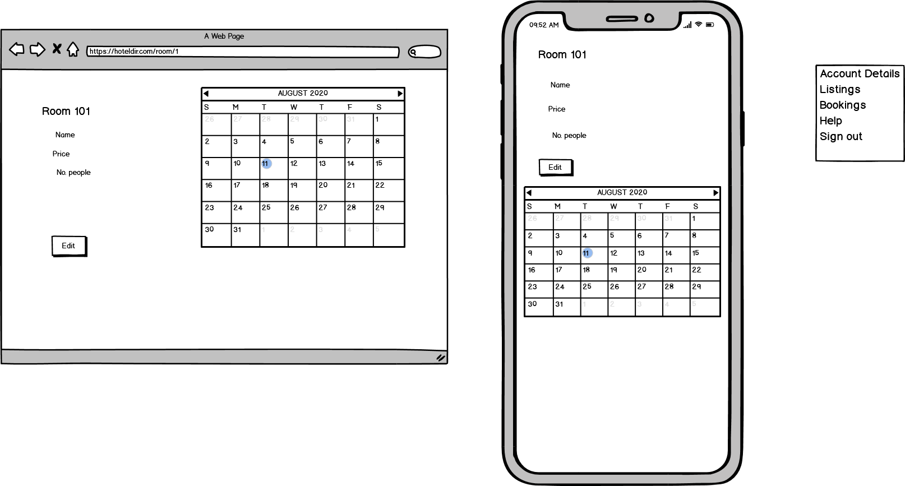

**Purpose**
    
The purpose of the app is to hold a database the listing of all the hotels with their rooms and bookings. The customer is able to search the database for listings that are available for a certain set of parameters such as date, location and room size. The problem being solved with this application is that it makes it easier to compare and book hotels. Also, sellers make their listings more accessible with this app.

The target audience for this app is for customers that want to book a room at hotels and the sellers that would like to list their hotel.

---

**Functionality / features**

When the app is opened, the root path is the home page. From this page, customers are able to search for a listing with the location, date and number of people search parameters. The customers are able to book a room with the listing that they have selected.

There is a payment page that confirms the booking and profile details. If the user doesn't have a profile there are redirected to new profile page. This is slightly poor UX as the user has to search for the listing again. It could possibly be better if the information is saved in the cookies and redirect back to the payment page or have the ability to edit the details on the page. There was going to be stripe involved in the payment details but wasn't implemented in the final deployment.

The app requires a login to preform actions and is handled by the Devise gem.

Sellers are able to add, update or delete their listings by going to the listing index page. The sellers can create and edit the rooms in these listings.

The listings are created with no rooms and rooms are added individually. A way to improve this is to have the rooms created on the new listing page and would require AJAX for adding new fields.

The admin can view all of the users and grant admin roles to them. Such as Seller will let the user to be able to place listings on the app. This is in place so that only people that are verified can advertise.

There are already user profiles that have been seeded in the deployed app and are named 'admin@email.com', 'seller1@email.com', 'seller2@email.com', 'seller3@email.com' with the password of 'rails1'. The admin can see all profiles and change their admin status. The sellers have pre-created listings in Brisbane, Sydney and Melbourne and have rooms for the dates 1/8/2020 to 10/8/2020.

The features that I didn't incorporate into the app are:

- Google maps API for location
- Being able to edit the calendar for the rooms and change their vacancy
- Setting up stripe
- Being able to cancel booking
- Sending mail confirmations of bookings
- Adding multiple images to the listing
- Changing the image of the listing
- Adding pagination for listings
- Adding user score for the listing

---

**Sitemap**

The app would start at the home page and have options to go to the listing, booking, login, register and profile pages via a navbar.

On the Listing Index page there are options to either show a particular listing or to create a new listing (if given authorization). With showing a certain listing it can be edited by the owner and has separate pages where rooms can be edited or added.

In the listing show page, a booking can be purchased if a customer had searched for the booking. Once the purchase has been made a confirm purchase page will display to say that it has been successful.

On the Booking page, the bookings that are made by a customer are shown with all the details.

The Login and Register pages are handled by the Devise gem and redirect to the correct forms.

The Profile index page displays all of the profiles if the current user is the admin and can edit their details. If the current user isn't the admin they are redirected to their profile page where they can create a new profile or update their details.

---

**Tech stack (e.g. html, css, deployment platform, etc)**

The tech stack that I am using for this app is:

- Rails
- Ruby
- SCSS
- CSS
- HTML
- Heroku

---

**User stories for your app**

Customer searches for listings by typing their search query in the home page or navbar. The page will redirect to the listings index and return the listings that match the conditions.

Customer places a booking after searching and selecting a room. This will redirect them to the payment page where they can check their details before purchasing.

Admin have the authorization to create a new listing by going to the listing index page and selecting 'Add Listing'.

Admin updates a listing by selecting 'Edit Listing' when viewing the listing.

Admin adds a room when viewing the listing

Admin updates a room when viewing the listing

Admin deletes a room when in edit room

Admin deletes a listing when in edit listing

Website admin able to accept new Admin by going to the Profiles Index page and viewing all of the profiles. By selecting a profile to edit, Admin can change their admin level.

Website admin able to accept new listings, so that the listing can be verified before it is made available to customers. However, this wasn't implemented in the final submission.

User creates an account by using the devise gem

User add their details by creating a profile, these details will be used in making a booking

User updates their details through viewing their profile and selecting 'Edit Profile'
    
---

**Wireframes for your app**

Home Page

Listing Index

Show single Listing

Editing a Listing

Viewing a room

Editing a room

Payment page

Payment Confirm page

New Profile

Profile Index

An ERD for your app

---

**Explain the different high-level components (abstractions) in your app**

The high level components of the app are:

- Customers that would like booking a room at a listing
- Sellers that place their listing on the marketplace
- Admin that can view all the users and change their authorization level

---

**Detail any third party services that your app will use**

Bootstrap is used to provide quick styling and responsive pages. The app uses the navbar and card component with a few changes to the original template.

There aren't any other third party services used in the app. However, I would have liked to implement Stripe that could handle credit card payments. There is also Google maps API, where I could have used it with searching and the distance from the original location. 

---

**Describe your projects models in terms of the relationships (active record associations) they have with each other**

The database has a number of tables that interact with each other and have set relationships between each other.

- The listings have many rooms
- The rooms of each listing have many bookings
- The users (sellers) can create many listings
- The users have one profile
- Each profile has one payment and address details

---

**Discuss the database relations to be implemented in your application**

The database relations are set by the conditions 'has_one', 'has_many' and 'belongs_to'

The listing would have 'has_many' rooms and 'has_one_attached' picture
The listing would have 'belongs_to' user
The rooms would have 'has_many' bookings and 'belongs_to' listing
The users would have 'has_many' listings
The users would have 'has_many' bookings
The users would have 'has_one' profile
the profile would have 'belongs_to' address, payment and user
The address and payment would have 'has_one' profile
The bookings would have 'belongs_to' room and user

These models would also include 'dependant: :destroy' to the values that would be deleted if another entry is deleted, such as deleting a listing would remove the rooms and bookings related to the listing.

---

**Provide your database schema design**

The database schema is created with rails commands. The command 'rails g Model Profile fname lname phone address:references payment:references' will generate a migration file for the profile table. The schema file will be changed once there is a 'rails db:migrate' to compile the migration files.

The final schema file is:

    ActiveRecord::Schema.define(version: 2020_08_05_050346) do

        enable_extension "plpgsql"

        create_table "active_storage_attachments", force: :cascade do |t|
            t.string "name", null: false
            t.string "record_type", null: false
            t.bigint "record_id", null: false
            t.bigint "blob_id", null: false
            t.datetime "created_at", null: false
            t.index ["blob_id"], name: "index_active_storage_attachments_on_blob_id"
            t.index ["record_type", "record_id", "name", "blob_id"], name: "index_active_storage_attachments_uniqueness", unique: true
        end

        create_table "active_storage_blobs", force: :cascade do |t|
            t.string "key", null: false
            t.string "filename", null: false
            t.string "content_type"
            t.text "metadata"
            t.bigint "byte_size", null: false
            t.string "checksum", null: false
            t.datetime "created_at", null: false
            t.index ["key"], name: "index_active_storage_blobs_on_key", unique: true
        end

        create_table "addresses", force: :cascade do |t|
            t.integer "street_no"
            t.string "street_name"
            t.string "suburb"
            t.string "state"
            t.integer "postcode"
            t.datetime "created_at", precision: 6, null: false
            t.datetime "updated_at", precision: 6, null: false
        end

        create_table "bookings", force: :cascade do |t|
            t.date "date"
            t.boolean "aval"
            t.datetime "created_at", precision: 6, null: false
            t.datetime "updated_at", precision: 6, null: false
            t.bigint "room_id", null: false
            t.bigint "user_id"
            t.index ["room_id"], name: "index_bookings_on_room_id"
            t.index ["user_id"], name: "index_bookings_on_user_id"
        end

        create_table "listings", force: :cascade do |t|
            t.string "name"
            t.string "location"
            t.datetime "created_at", precision: 6, null: false
            t.datetime "updated_at", precision: 6, null: false
            t.bigint "user_id", null: false
            t.index ["user_id"], name: "index_listings_on_user_id"
        end

        create_table "payments", force: :cascade do |t|
            t.integer "card_no"
            t.string "card_name"
            t.integer "CSV"
            t.string "expiry"
            t.datetime "created_at", precision: 6, null: false
            t.datetime "updated_at", precision: 6, null: false
        end

        create_table "profiles", force: :cascade do |t|
            t.string "fname"
            t.string "lname"
            t.string "role"
            t.integer "phone"
            t.bigint "payment_id", null: false
            t.bigint "address_id", null: false
            t.bigint "user_id", null: false
            t.datetime "created_at", precision: 6, null: false
            t.datetime "updated_at", precision: 6, null: false
            t.index ["address_id"], name: "index_profiles_on_address_id"
            t.index ["payment_id"], name: "index_profiles_on_payment_id"
            t.index ["user_id"], name: "index_profiles_on_user_id"
        end

        create_table "rooms", force: :cascade do |t|
            t.string "name"
            t.integer "price"
            t.integer "no_people"
            t.boolean "aval"
            t.datetime "created_at", precision: 6, null: false
            t.datetime "updated_at", precision: 6, null: false
            t.bigint "listing_id", null: false
            t.index ["listing_id"], name: "index_rooms_on_listing_id"
        end

        create_table "users", force: :cascade do |t|
            t.string "email", default: "", null: false
            t.string "encrypted_password", default: "", null: false
            t.string "reset_password_token"
            t.datetime "reset_password_sent_at"
            t.datetime "remember_created_at"
            t.datetime "created_at", precision: 6, null: false
            t.datetime "updated_at", precision: 6, null: false
            t.integer "admin", default: 1
            t.index ["email"], name: "index_users_on_email", unique: true
            t.index ["reset_password_token"], name: "index_users_on_reset_password_token", unique: true
        end

        add_foreign_key "active_storage_attachments", "active_storage_blobs", column: "blob_id"
        add_foreign_key "bookings", "rooms"
        add_foreign_key "bookings", "users"
        add_foreign_key "listings", "users"
        add_foreign_key "profiles", "addresses"
        add_foreign_key "profiles", "payments"
        add_foreign_key "profiles", "users"
        add_foreign_key "rooms", "listings"
    end

---

**Describe the way tasks are allocated and tracked in your project**

The way that the project was managed was through a Trello board. I had started by stating all of the requirements of the project so that I would have quick reference and keep on track.

Once the ERD and wireframes had been created, the tasks had been broken down by setting tasks such as 'Create Listing table', 'User Details Form' or 'Add cancancan' to make the project more manageable. Once all of the tasks had been created I would move some tasks to the 'In Progress' tab and start working on the section. Once completed, I move the task to committing tab so that I remember to commit to github before moving on to the next section. 

As the project had progressed there were new bugs or features that needed to be implemented. These tasks were added to the backlog and followed the same process.

---

A link (URL) to your deployed app (i.e. website) - https://cw12-hoteldirectory.herokuapp.com/

A link to your GitHub repository (repo). - https://github.com/ChrisWhite12/HotelDB_Rails